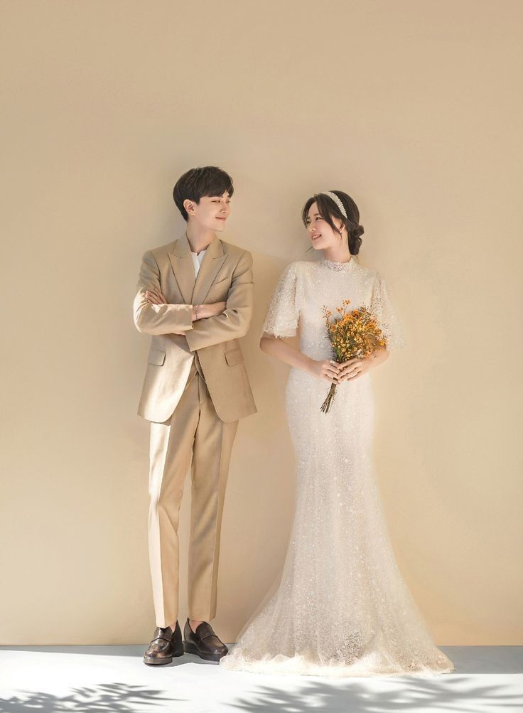
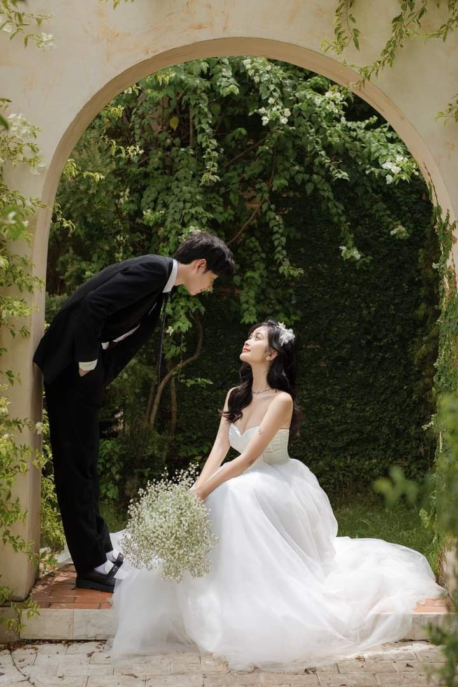
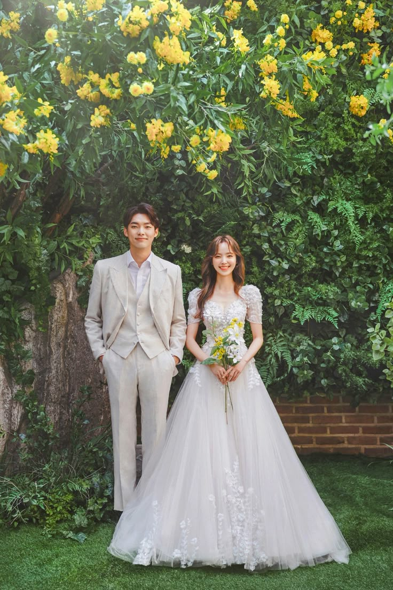

<!DOCTYPE html>
<html lang="id">
<head>
<meta charset="utf-8" />
<meta name="viewport" content="width=device-width, initial-scale=1" />
<title>Undangan Pernikahan – Gilang & Oci</title>
<link href="https://fonts.googleapis.com/css2?family=Playfair+Display:wght@500;700&family=Poppins:wght@300;400;500;600&display=swap" rel="stylesheet">
<link rel="stylesheet" href="style.css">
</head>
<body>
<audio id="bg-music" loop>
  <source src="musik.mp3" type="audio/mpeg">
</audio>
<button class="music-control" id="musicBtn">🔊</button>

<!-- Welcome screen -->

  <h1 class="welcome-title">Undangan Pernikahan Gilang & Oci</h1>
  <button class="welcome-btn" id="openBtn">Buka Undangan</button>

<!-- Transition clouds -->

  

  

  

  

<!-- Butterflies container -->

<!-- Stars -->

  
  <header class="hero">
    Undangan Pernikahan
    <h1 class="names">Gilang &amp; Oci</h1>
    
Minggu, 26 Oktober 2025 • 09.00 WIB

    

    <!-- ✅ Countdown baru -->
    

      

        
00

        
Hari

      

      

        
00

        
Jam

      

      

        
00

        
Menit

      

      

        
00

        
Detik

      

    

    <!-- ✅ Akhir countdown -->
  </header>

  <section class="card-elegant">
  <h3 class="card-title">AKAD NIKAH</h3>
  

    Minggu
    26
    Oktober 2025
  

  
09.00 WIB – Selesai

  

    Kediaman Mempelai
  

  

    <a class="btn-outline" href="https://calendar.google.com/calendar/r/eventedit?text=Akad+Gilang+%26+Oci&dates=20251026T020000Z/20251026T040000Z&details=Akad+nikah&location=Kediaman+Mempelai" target="_blank">Simpan ke Kalender</a>
  

</section>

  <section class="card-elegant">
  <h3 class="card-title">RESEPSI</h3>
  

    Minggu
    26
    Oktober 2025
  

  
09.00 WIB – Selesai

  

    Kp. Pusar RT 006/01 Binong, Kec. Curug, Kab. Tangerang – Banten
  

  

    <a class="btn-outline" href="https://www.google.com/maps/search/?api=1&query=Kp.+Pusar+RT+006%2F01+Binong+Curug+Tangerang+Banten" target="_blank">Lihat Lokasi</a>
  

</section>

    <section class="card-elegant">
  <h3 class="card-title">MEMPELAI</h3>
  

    

      
<strong>Gilang Darmawan Gilang</strong>

      
Putra pertama dari Bpk. Wani Setiawan &amp; Ibu Sunyah

    

    
&amp;

    

      
<strong>Siti Rosidah (Oci)</strong>

      
Putri ke-2 dari Bpk. Mahmud &amp; Ibu Minah

    

  

</section>

    <!-- Galeri Prewedding -->
    <section class="card gallery">
      <h3>Galeri Prewedding</h3>
      

        
        
        
        
        
      

    </section>

    <section class="card" id="ucapan" style="grid-column:1/-1">
      <h3>Ucapan & Doa</h3>
      
Atas kehadiran dan doa restunya Bapak/Ibu/Saudara/i, kami ucapkan terima kasih.

      
Wassalamu’alaikum Wr. Wb.

    </section>
  </main>

  
Kami yang berbahagia, <strong>Gilang &amp; Oci</strong>

  <footer>© 2025 Gilang & Oci</footer>

<!-- Lightbox -->

  

<!-- Bottom Navigation -->
<nav class="bottom-nav" id="bottomNav">
  <a href="#page">🏠 Beranda</a>
  <a href="#ucapan">🙏 Ucapan</a>
  <a href=".gallery">📸 Galeri</a>
  <a href="https://www.google.com/maps/search/?api=1&query=Kp.+Pusar+RT+006%2F01+Binong+Curug+Tangerang+Banten" target="_blank">📍 Lokasi</a>
</nav>

<button class="theme-toggle" id="themeBtn">🎨 Ganti Tema</button>

</body>
</html>
